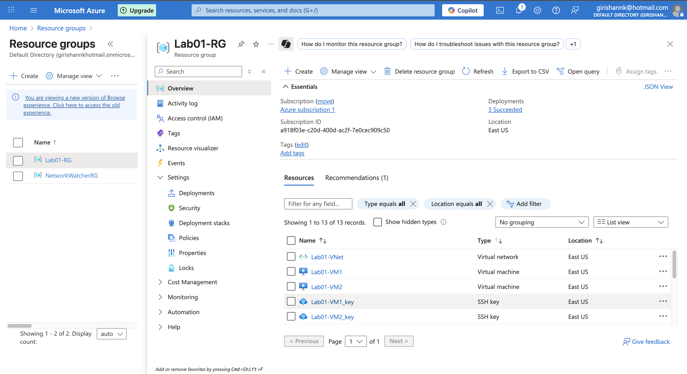
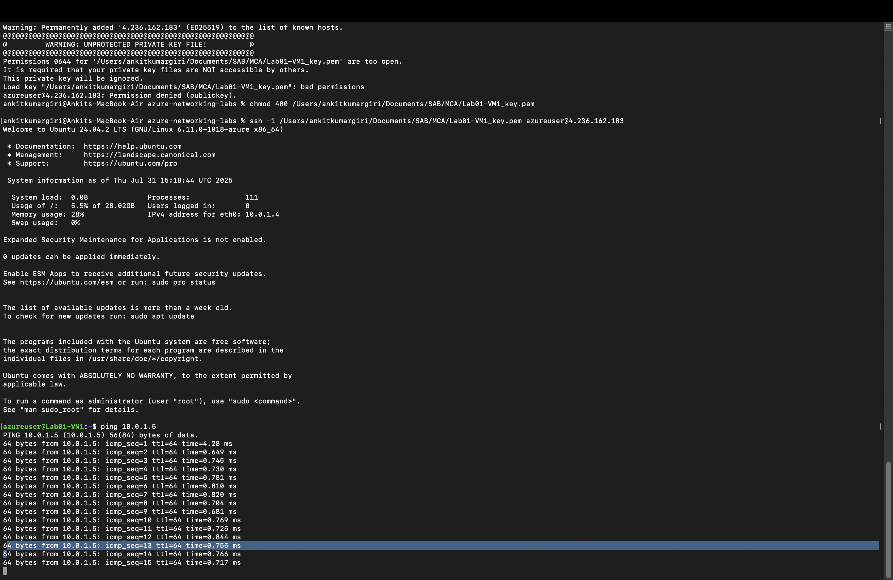
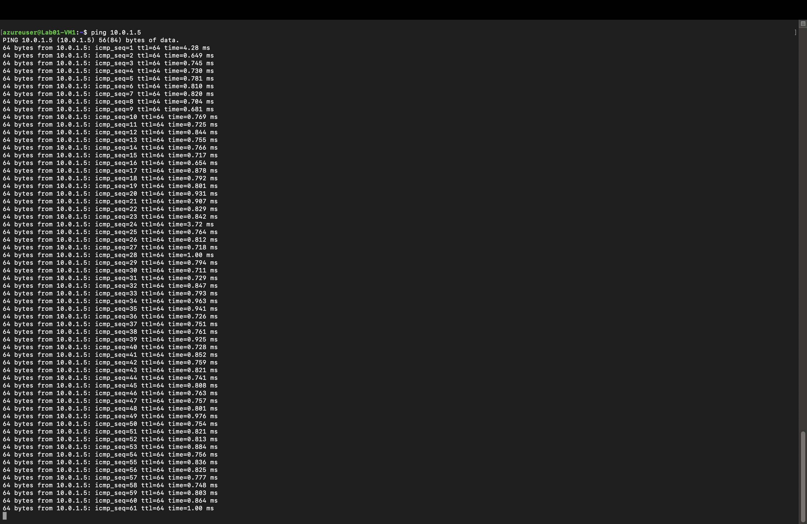

# Lab 01: Azure Virtual Networking

## 🎯 Objective
Establish a virtual network with two Linux VMs in Azure and test private communication between them.

## ⚙️ Lab Setup
- **Resource Group**: Lab01-RG
- **Virtual Network**: 10.0.0.0/16
- **Subnet**: 10.0.1.0/24
- **VM1 Private IP**: 10.0.1.4
- **VM2 Private IP**: 10.0.1.5
- **NSG Rules**: Default (ICMP allowed within subnet)

## ✅ Tasks Performed
1. Created a virtual network and subnet.
2. Launched two Linux VMs (VM1, VM2).
3. Used SSH to connect into VM1.
4. Ran `ping` to VM2's private IP to verify connectivity.

## 📸 Screenshots

### Azure Portal Setup

### SSH into VM1 and Ping VM2

## 📚 What I Learned
- CIDR/Subnetting basics.
- How private communication works in Azure VNet.
- SSH and ICMP test verification.

