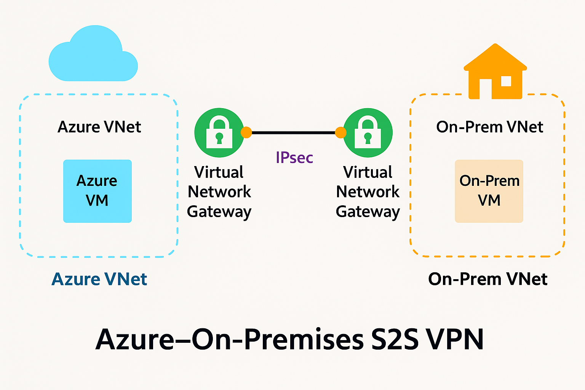

# Lab 08 – Site-to-Site VPN

## 🎯 Objective
Establish and test a Site-to-Site (S2S) VPN connection between Azure and an on-premises network, then troubleshoot common connectivity issues such as tunnel down, shared key mismatches, and route misconfigurations.

## Topology

## 🗂 Lab Overview
This lab simulates a hybrid networking scenario where:
- **Azure Side**: Virtual Network Gateway connects to Azure VNet hosting an Azure VM.
- **On-Premises Side**: Simulated using another Azure VNet or local VM representing an on-prem network.
- **VPN**: IPsec/IKE S2S VPN tunnel configured between both gateways.

## 🛠 Prerequisites
- Azure subscription with permissions to create:
  - Virtual networks
  - VPN gateways
  - Network security groups
  - Virtual machines
- SSH key pair for VM access
- Basic knowledge of Azure Networking and IPsec VPNs

## ⚙️ Lab Steps
1. **Create Azure Resources**
   - Azure VNet (Azure side)
   - Virtual Network Gateway (Azure side)
   - Azure VM (Test machine)

2. **Set Up On-Premises Side**
   - Create simulated on-prem VNet
   - Create Virtual Network Gateway (on-prem side)
   - Deploy on-prem VM

3. **Configure Site-to-Site VPN**
   - Exchange public IPs of both VPN gateways
   - Configure shared key (must match on both sides)
   - Set up address spaces and routes

4. **Validate the Tunnel**
   - Check connection status in Azure Portal
   - SSH into Azure VM and ping on-prem VM
   - SSH into on-prem VM and ping Azure VM

5. **Troubleshooting**
   - See [troubleshooting.md](troubleshooting.md) for detailed steps if:
     - Tunnel is down
     - No connectivity
     - Packet loss

## 📦 Deliverables
- Screenshots of:
  - VPN configuration
  - Successful ping/SSH between VMs
  - Connection status in Azure Portal
- `troubleshooting.md` documentation

## 🔗 References
- [Microsoft Docs – Configure a Site-to-Site connection](https://learn.microsoft.com/en-us/azure/vpn-gateway/vpn-gateway-howto-site-to-site-resource-manager-portal)
- [Microsoft Docs – VPN Gateway FAQ](https://learn.microsoft.com/en-us/azure/vpn-gateway/vpn-gateway-vpn-faq)
